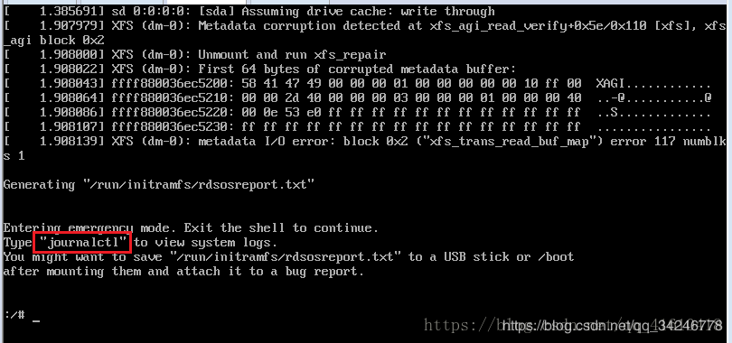

#### CENTOS7开机启动出现错误ENTERING EMERGENCY MODE. EXIT THE SHELL TO CONTINUE

执行日志：

    journalctl
按enter向下一行，space(空格)向下一页
翻到最后一页  
（failed to mount /sysroot. Dependency failed for Initrd root File System. Dependency failed for Reload configuration from the Real Root.），查看红色地方XFS（）是什么
我的是XFS（sda3）

    xfs_repair -v -L /dev/sda3 
    xfs_repair -v -L /dev/你的存在问题的设备 
 然后重启

    reboot
