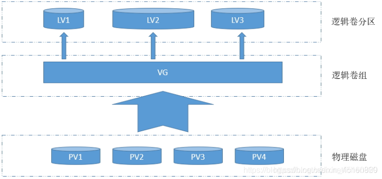
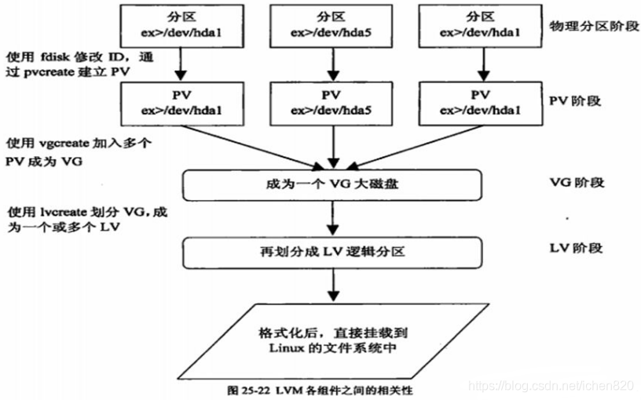
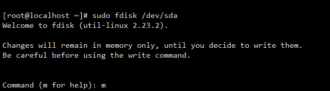
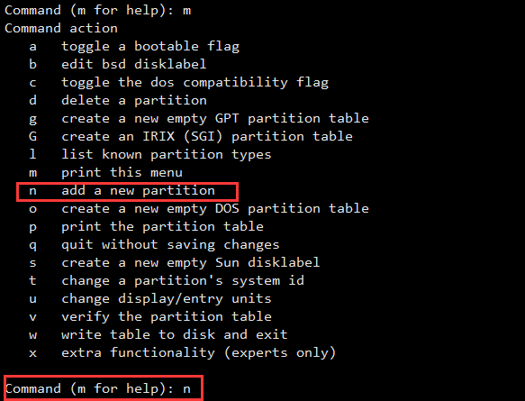
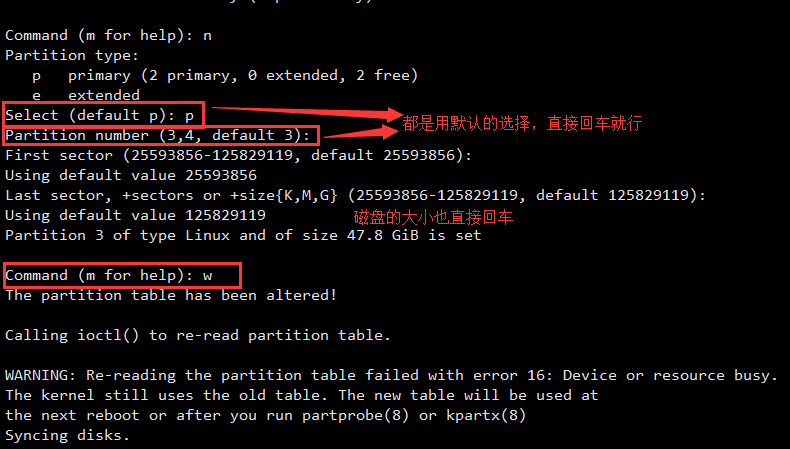
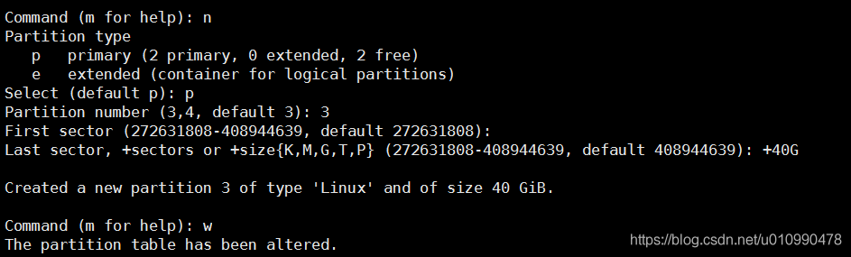
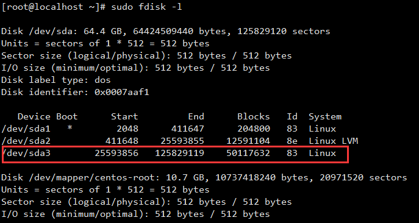
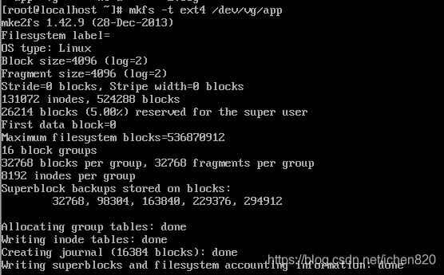
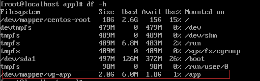
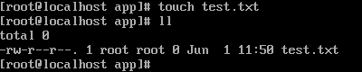

### CentOS虚拟机根分区磁盘扩容操作
https://blog.csdn.net/sinat_27674731/article/details/113740374

# 启动容器时，报如下错：
    docker: Error response from daemon: failed to copy files: copy file range failed: no space left on device.

## 解决方法 CentOS7 LVM 解决方案
### LVM 简介

    PV　　(Physical Volume)　　物理卷

    VG　　(Volume Group)   　　卷组
    
    LV　　(Logical Volume)　 　逻辑卷
LVM常用命令  
    功能  		    PV管理命令	     VG管理命令  	 	LV管理命令

    scan 扫描		 pvscan				vgscan				lvscan
    create 创建		 pvcreate			vgcreate			lvcreate
    display 显示	 pvdisplay			vgdisplay			lvdisplay
    remove 移除		 pvremove			vgremove			lvremove
    extend 扩展	 						vgextend			lvextend(lvresize)
    reduce 减少	 						vgreduce			lvreduce(lvresize)
    resize改变容量											lvresize
    attribute 改变属性 pvchange			vgchange			lvchange
---
    查看硬盘空间：df -h
    查看索引空间：df -i
    磁盘分区情况：fdisk -l /dev/sda如下：
    
    Disk /dev/sda: 21.5 GB, 21474836480 bytes
    255 heads, 63 sectors/track, 2610 cylinders
    Units = cylinders of 16065 * 512 = 8225280 bytes
    Sector size (logical/physical): 512 bytes / 512 bytes
    I/O size (minimum/optimal): 512 bytes / 512 bytes
    Disk identifier: 0x0002133f
    
    Device Boot      Start         End      Blocks   Id  System
    
    /dev/sda1   *           1          64      512000   83  Linux
    /dev/sda2              64        2611    20458496   8e  Linux LVM

### 第一、扩展虚拟机硬盘空间
#### 1 创建物理分区
    命令进入fdisk命令模式:
    sudo fdisk /dev/sda
    
    命令	    含义                    操作流程
    n (new)	    添加一个新分区
    p (print)	打印分区表
    w (write)	添将表写入磁盘并退出
    d (delete)	删除一个分区         d删除分区，回车（默认删除分区号4），p（查看分区）发现已经还剩3个主分区了
   
    p 主分区:
    都用主分区的话，最多可以划分4个。如果想划分多个的话，可以划分3个主分区。另外一个划分为扩展分区。在扩展分区里面再接着划分逻辑分区。
    创建主分区流程：
    创建第一个主分区（+2G）
    n创建新分区，p选择主分区，回车（默认分区号1），回车（默认磁盘扇区从2048开始），+2G（设置分区大小为2G）
   
    e 扩展分区
    

出现这个界面后输入n，创建新的分区。

  
Partition type、Partition number和磁盘的范围都是默认就行，敲四个回车就可以。之后输入w写入分区表。

  
也可以自己输入大小：n创建新分区，p选择主分区，输入分区号4（默认分区号1），扇区起始位置按回车（默认磁盘扇区从2048开始），第二个位置输入+200G（设置分区大小为2G）   
  
选择合适的分区大小，这里分为40G，K为KB,M为MB，G为GB,T为TB，P为PB。 
输入sudo fdisk -l查看磁盘信息，会看到新出现的/dev/sda3。

### 【注意这里必须重启虚拟机】
#### 2 基于物理分区 创建物理卷（PV）
     partprobe /dev/sda4
     pvcreate /dev/sda4 
     通过 pvdisplay 或 pvs 查看当前的pv信息 

#### 3 基于物理卷（PV）创建卷组（VG  将PV加入到卷组中 通过vgcreate命令）
     vgcreate cotenosvg /dev/sda4
     通过 vgdisplay 或 vgs 命令查看vg的信息 

#### 4 基于卷组（VG）创建逻辑卷(LV)
    lvcreate -n  ExpandDisk1 -L 180G cotenosvg
    通过 lvdisplay 或 lvs 命令查看创建好的逻辑卷

#### 5 格式化文件系统
    mkfs -t ext4 /dev/cotenosvg/ExpandDisk1 用ext4的格式格式化/dev/cotenosvg/ExpandDisk1 
    查看：cd /dev/cotenosvg/ExpandDisk1

#### 6 挂载
    创建挂载点
    mkdir /ExpandDisk1
    将/dev/cotenosvg/ExpandDisk1 挂载到/ExpandDisk1
    
    mount /dev/cotenosvg/ExpandDisk1 /ExpandDisk1
然后df -h 可以看到已经挂载到/app下了 ，大小为lv 的大小180G

    cd /ExpandDisk1  
touch test.txt 在/ExpandDisk1 下创建一个测试文件test.txt，可以看到该挂载点是可以用了。

#### 7 设置开机加载
    echo "/dev/cotenosvg/ExpandDisk1 /ExpandDisk1 ext4 defaults 0 0" >>/etc/fstab
    
     开机自动挂载
    vi /etc/fstab
    
    在最下增加一行：
    /dev/db-lv/lv   /mnt/lvm        ext4    defaults        0       0

#### 参考文献
https://blog.csdn.net/ichen820/article/details/106274392
 

### 第二 删除卷组 
    
    1.取消挂载
    umount /mnt/lv0 
    
    2.取消逻辑卷
    lvremove /dev/vg0/lv0
     
    3.取消卷组（直接写卷组名称就可以）
    vgremove vg0 
    
    4.取消物理卷
    pvremove /dev/sd{b,c}{1,2,3} 
    
    5.删除主分区
     sudo fdisk /dev/sda  # sudo fdisk /dev/sdb...
     输入：d
     输入：分区号{1,2,3,4}
     d删除分区，回车（默认删除分区号4），p（查看分区）发现已经还剩3个主分区了
     
#### 参考文献
https://blog.csdn.net/ichen820/article/details/106274392

### 第三 其他、暴力方法 删除无用数据
错误原因是，docker  里面存在很多孤立的卷（删除容器的遗留），可以使用以下命令查看

    docker volume ls -qf dangling=true  

将会显示所有"已作废"的卷,具体里面有没有有用信息，自行判断。只需要将这些卷彻底删除，磁盘就够用了，执行：

    docker volume rm $(docker volume ls -qf dangling=true) #会删除mysql相关资源 慎用

 

**参考文献**
    https://www.cnblogs.com/raisins/p/13224353.html
    http://blog.key9.cn/index.php/article/90.html    
    https://www.cnblogs.com/bitter-first-sweet-last/p/6638634.html