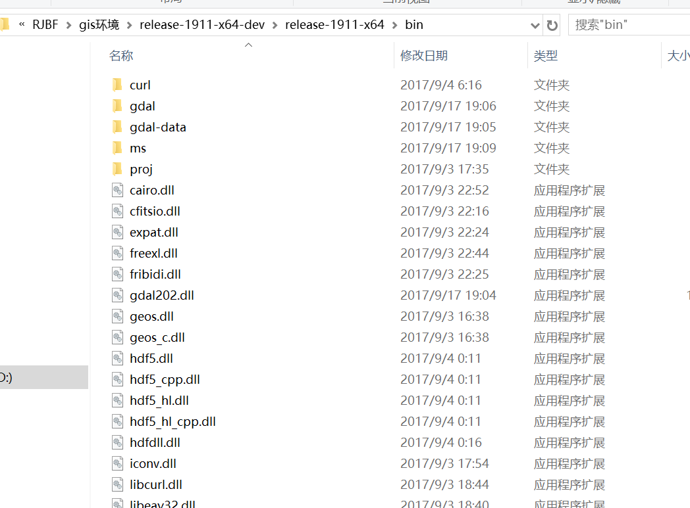
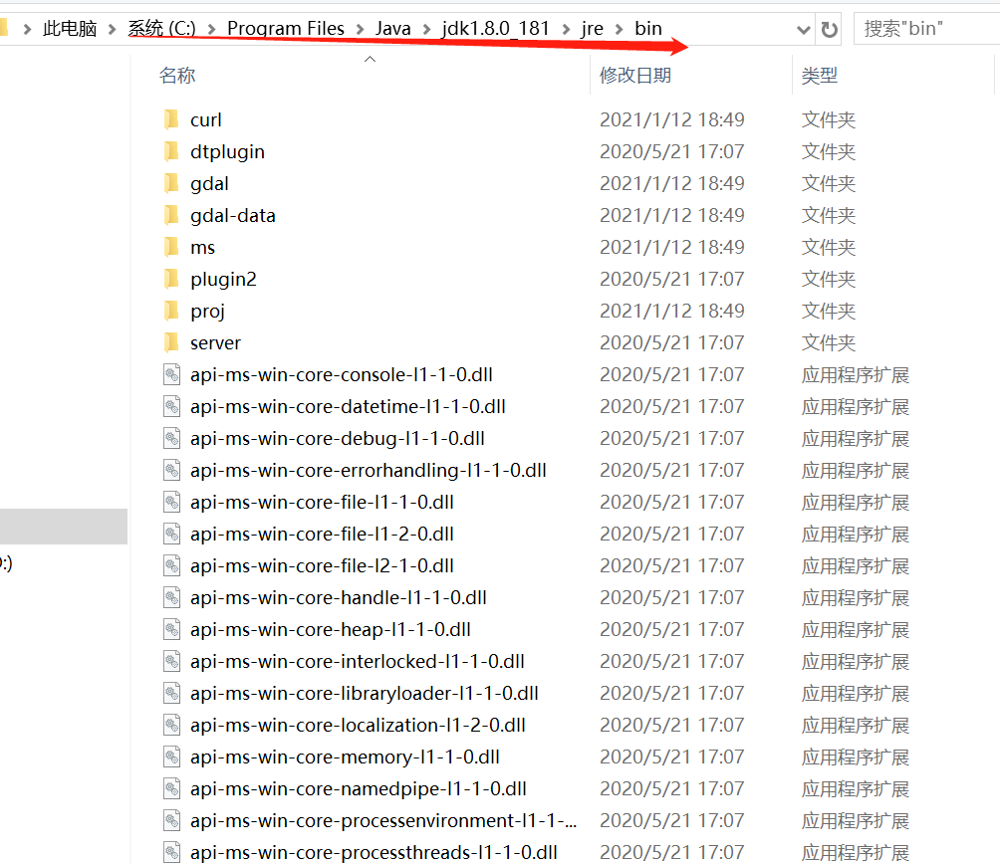
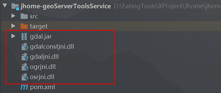

## GDAL环境配置
下载release-1911-x64-dev   

将下载后的E:\workspace\release-1600-x64-gdal-1-11-1-mapserver-6-4-1\bin目录下的所有.dll文件 copy 到
    
下，将Java依赖GDAL的核心文件，拷贝到java项目工程文件中   

#### 参考文献
https://blog.csdn.net/admintys/article/details/90905400   
https://blog.csdn.net/youxia918/article/details/46851465

