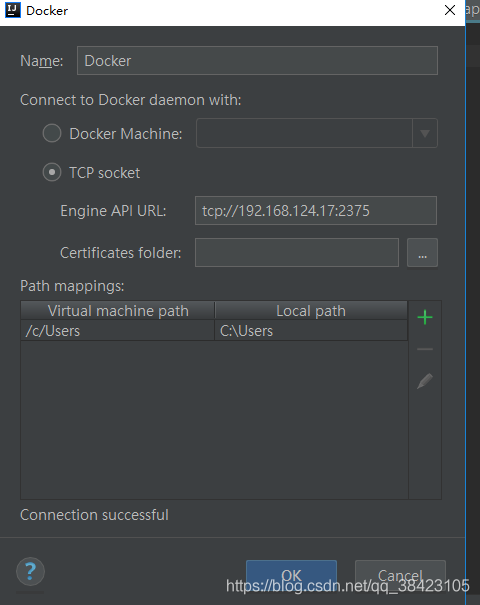

背景：centos7
1. vi /usr/lib/systemd/system/docker.service 修改 [Service]的ExecStart，ExecStart= 一定要加

    [Service]
    Type=notify
    # the default is not to use systemd for cgroups because the delegate issues still
    # exists and systemd currently does not support the cgroup feature set required
    # for containers run by docker
    ExecStart=
    ExecStart=/usr/bin/dockerd -H tcp://0.0.0.0:2375 -H unix://var/run/docker.sock
2. 刷新配置文件，重启docker     

        systemctl daemon-reload
        systemctl restart docker
3. 查看docker进程是否监听

        [root@localhost ~]# netstat -ano | grep 2375
        tcp6       0      0 :::2375                 :::*                    LISTEN      off (0.00/0/0)
4.查看系统网络端口2375是否被docker所监听

        [root@localhost ~]# netstat -tulp
        Active Internet connections (only servers)
        Proto Recv-Q Send-Q Local Address           Foreign Address         State       PID/Program name    
        tcp        0      0 0.0.0.0:ssh             0.0.0.0:*               LISTEN      3124/sshd           
        tcp        0      0 localhost:smtp          0.0.0.0:*               LISTEN      3379/master         
        tcp6       0      0 [::]:2375               [::]:*                  LISTEN      13964/dockerd       
              
5.添加防火墙2375/tcp ，并重载防火墙

    [root@localhost ~]#  firewall-cmd --zone=public --add-port=2375/tcp --permanent
    success
    [root@localhost ~]# firewall-cmd --reload
success
6. 使用idea测试连接docker， 看到Connection successful说明连接成功
 
 
 ### 参考文献 
https://blog.csdn.net/qq_38423105/article/details/88385673