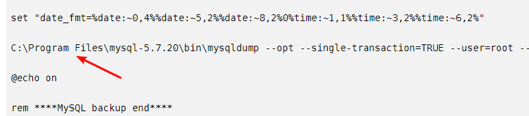

    rem ******MySQL backup start******
    @echo off
    
    forfiles /p "D:\Mysql_Backup" /m test_backup_*.sql -d -30 /c "cmd /c del /f @path"
    
    set "Ymd=%date:~0,4%%date:~5,2%%date:~8,2%0%time:~1,1%%time:~3,2%%time:~6,2%"
    mysqldump --opt --single-transaction=TRUE --user=root --password=123456 --host=127.0.0.1 --protocol=tcp --port=3306 --default-character-set=utf8 --single-transaction=TRUE --routines --events "test" > D:\Mysql_Backup\test_backup_%Ymd%.sql
    
    @echo on
    rem ******MySQL backup end******
    
  但是在实际使用时遇到了两个问题，这点很多教程都没有提示到：    
  1,虽然在指定目录下生成了sql备份文件，但是文件内容却是空的  
  2,在执行删除命令的时候会提示语法错误
  
  对于第一点文件为空的主要原因就是这条备份语句的路径有空格，导致命令无法识别

####方式就是把mysqldump这个exe程序复制到一个没有空格的路径下就可以了
   
   
    rem ******MySQL backup start******
    @echo off
    
    forfiles /p "D:\Mysql_Backup" /m test_backup_*.sql -d -30 /c "cmd /c del /f @path"
    
    set "Ymd=%date:~0,4%%date:~5,2%%date:~8,2%0%time:~1,1%%time:~3,2%%time:~6,2%"
    D:/mysqldump --opt --single-transaction=TRUE --user=root --password=123456 --host=127.0.0.1 --protocol=tcp --port=3306 --default-character-set=utf8 --single-transaction=TRUE --routines --events "test" > D:\Mysql_Backup\test_backup_%Ymd%.sql
    
    @echo on
    rem ******MySQL backup end******
    
 对于第二个执行删除命令的时候报错的问题就更简单了，其实根本就不算是错误，因为刚开始部署这个批处理文件的时候根本就没有文件让你去删除，所以找不到文件才报的错，可以把删除的时间改成今天就可以看到效果了
    
 
 这个位置填写要保留的日期，7就表示保留7天，因为没有7天以上的数据，所以这个地方找不到文件就会有错误提示，如果已经有当天的生成的备份文件的话把这个改成0试一下就是可以删除的了
### 参考文献
    https://blog.csdn.net/ht_kasi/article/details/103078308