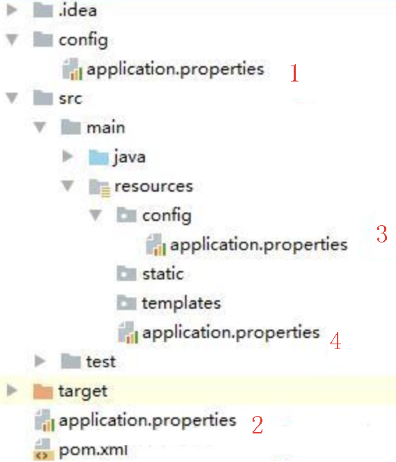

##1. 项目内部配置文件  
spring boot 启动会扫描以下位置的application.properties或者application.yml文件作为Spring boot的默认配置文件

    　　–file:./config/  
    　　–file:./   
    　　–classpath:/config/  
    　　–classpath:/
 
     
以上是按照优先级从高到低的顺序，所有位置的文件都会被加载，高优先级配置内容会覆盖低优先级配置内容。

SpringBoot会从这四个位置全部加载主配置文件，如果高优先级中配置文件属性与低优先级配置文件不冲突的属性，则会共同存在—互补配置。
可以通过配置spring.config.location来改变默认配置。

    java -jar spring-boot-02-config-02-0.0.1-SNAPSHOT.jar --spring.config.location=file:///D:/application.properties,classpath:/,classpath:/config/
项目打包好以后，我们可以使用命令行参数的形式，启动项目的时候来指定配置文件的新位置。

##2. 外部配置加载顺序
SpringBoot也可以从以下位置加载配置：优先级从高到低；高优先级的配置覆盖低优先级的配置，所有的配置会形成互补配置。

1.命令行参数

所有的配置都可以在命令行上进行指定；
多个配置用空格分开； –配置项=值  

      
   
    java -jar spring-boot-02-config-02-0.0.1-SNAPSHOT.jar --server.port=8087 --server.context-path=/abc
    　　
    java -jar spring-boot-02-config-02-0.0.1-SNAPSHOT.jar ^
    --server.port=8087 ^
    --spring.profiles.active=dev ^
    --spring.datasource.url="" ^
    --spring.datasource.username=management ^
    --spring.datasource.password=123456 ^
    --fdfs.storagePort=90 ^
    --fdfs.resHost=192.168.1.35 ^
    --fdfs.tracker-list=192.168.1.35:22122

 
2.来自java:comp/env的JNDI属性 

3.Java系统属性（System.getProperties()） 

4.操作系统环境变量 

5.RandomValuePropertySource配置的random.*属性值

6.jar包外部的application-{profile}.properties或application.yml(带spring.profile)配置文件

7.jar包内部的application-{profile}.properties或application.yml(带spring.profile)配置文件

8.jar包外部的application.properties或application.yml(不带spring.profile)配置文件

9.jar包内部的application.properties或application.yml(不带spring.profile)配置文件

10.@Configuration注解类上的@PropertySource 

11.通过SpringApplication.setDefaultProperties指定的默认属性