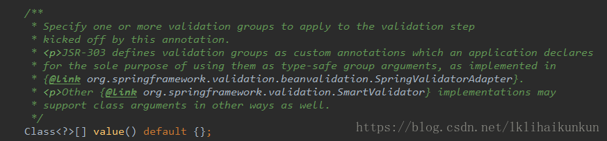
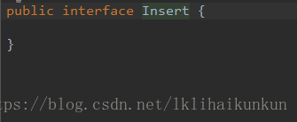
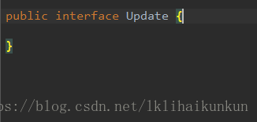
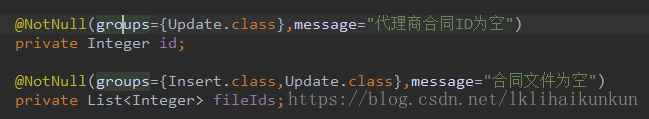

之前知道spring支持JSR校验,在自己定义的bean中加入@NotNull,@NotBlank,@Length等之类的校验用于处理前台传递过来的request请求,避免在写多余的代码去处理.
但是随着业务的复杂度增加,对于校验的制定也越来越有要求,这个时候就需要引入分组group的概念,在自定义注解@Validated中

定义了一个Class[]数组用来分组.这样我们就可以引入分组校验的概念,首先根据需要的分组新建自己的接口.

然后在需要校验的bean上加入分组:

最后根据需要,在Controller处理请求中加入@Validated注解并引入需要校验的分组.
  
    @Validated({Insert.class})AgentContractBean paramBean

整个Spring请求bean的分组校验就算是完成了.